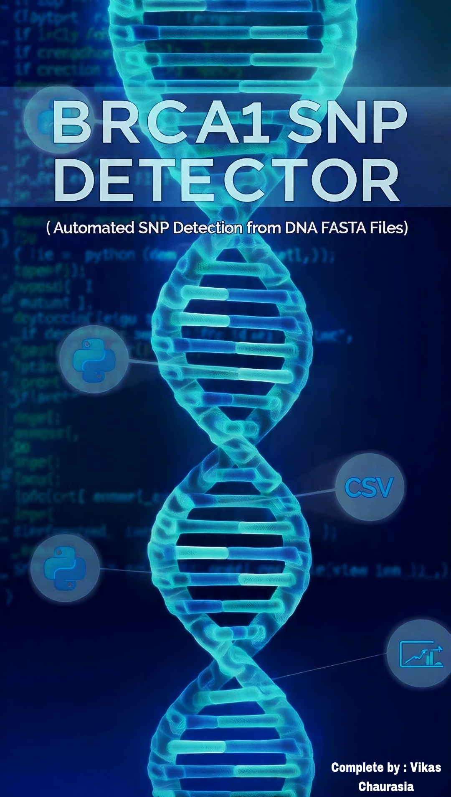
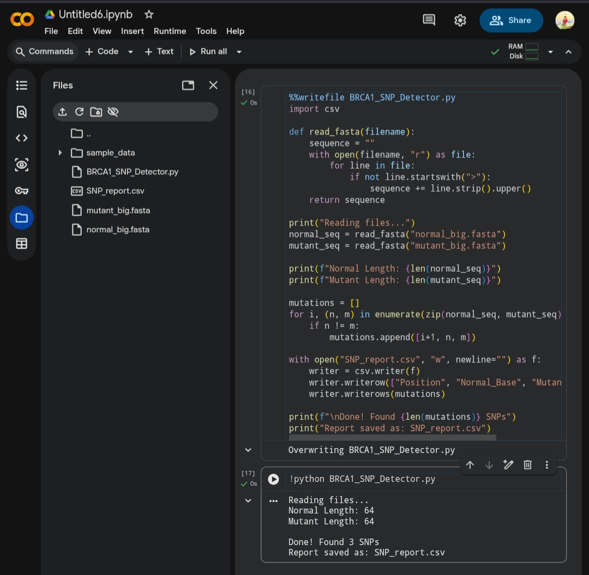

# BRCA1 SNP DETECTOR 🧬

Automated SNP Detection from DNA FASTA Files using Python

## Project Poster

---

## About
A Python tool to detect Single Nucleotide Polymorphisms (SNPs) by comparing normal and mutant DNA sequences from FASTA files.

## Key Features
- ✅ Reads DNA from `.fasta` files 
- ✅ Detects SNPs with position and base change
- ✅ Exports results to `SNP_report.csv`
- ✅ Works in Google Colab / Local Python

## Screenshots

### 1. Tool Running - Detected 3 SNPs

### 2. CSV Report Generated

